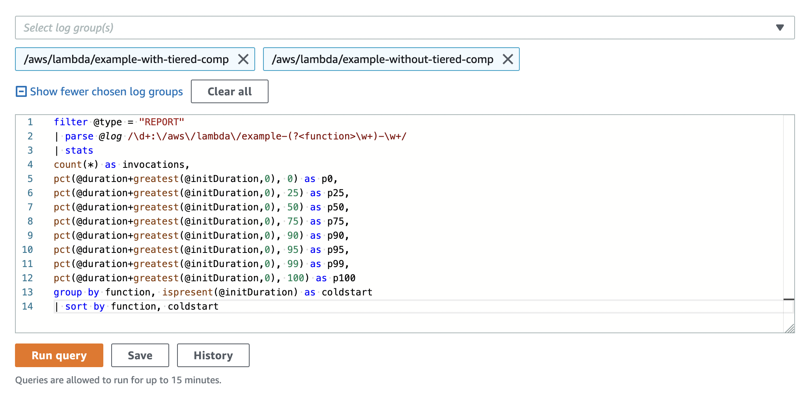

# AWS Lambda Tiered Compilation Sample

## Getting started

Download or clone the repository.

To install prerequisite software:

1. Install [AWS CDK](https://docs.aws.amazon.com/cdk/latest/guide/getting_started.html)
2. Install [Apache Maven](https://maven.apache.org/install.html) (or use your preferred IDE)
3. Build and package the Java application in the software folder:

```bash
cd software/ExampleFunction/
mvn package
```

4. Synthesize CDK. This previews changes to your AWS account before it makes them:

```bash
cd infrastructure
cdk synth
```

5. Deploy the Lambda functions:

```bash
cdk deploy --outputs-file outputs.json
```

The API Gateway endpoint URL is displayed in the output and saved in a file named outputs.json. The contents are similar to:

```
ExampleTieredCompStack.apiendpoint = https://{YOUR_UNIQUE_ID_HERE}.execute-api.eu-west-1.amazonaws.com
```

## Using Artillery to load test the changes

First, install prerequisites:

1. Install [jq](https://stedolan.github.io/jq/) and [Artillery Core](https://artillery.io/docs/guides/getting-started/installing-artillery.html)
2. Run the following two scripts from the `/infrastructure` directory:

```bash
artillery run -t $(cat outputs.json | jq -r '.ExampleTieredCompStack.apiendpoint') -v '{ "url": "/without" }' loadtest.yml
artillery run -t $(cat outputs.json | jq -r '.ExampleTieredCompStack.apiendpoint') -v '{ "url": "/with" }' loadtest.yml
```

### Check results in Amazon CloudWatch Insights

1. Navigate to Amazon CloudWatch. 
2. Select **Logs** then **Logs Insights**.
3. Select the following two log groups from the drop-down list:

```
/aws/lambda/example-with-tiered-comp
/aws/lambda/example-without-tiered-comp
```

4. Copy the following query and choose **Run query**:

```
filter @type = "REPORT"
| parse @log /\d+:\/aws\/lambda\/example-(?<function>\w+)-\w+/
| stats
count(*) as invocations,
pct(@duration, 0) as p0,
pct(@duration, 25) as p25,
pct(@duration, 50) as p50,
pct(@duration, 75) as p75,
pct(@duration, 90) as p90,
pct(@duration, 95) as p95,
pct(@duration, 99) as p99,
pct(@duration, 100) as p100
group by function, ispresent(@initDuration) as coldstart
| sort by function, coldstart
```



You see results similar to:


## Security

See [CONTRIBUTING](CONTRIBUTING.md#security-issue-notifications) for more information.

## License

This library is licensed under the MIT-0 License. See the LICENSE file.

